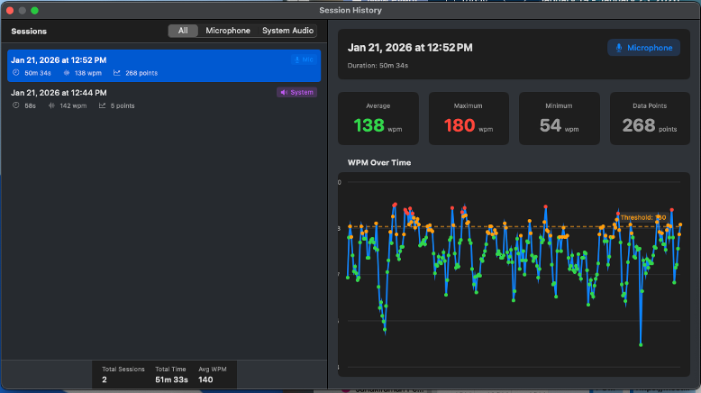

# Slowdown

<p align="center">
  
</p>

<p align="center">
  <strong>Monitor your speech pace in real-time</strong><br>
  A macOS menu bar app that helps you maintain the perfect speaking pace for presentations and demos
</p>

<p align="center">
  <a href="https://github.com/gomleksiz/slowdown/releases/latest">
    
  </a>
  <a href="https://github.com/gomleksiz/slowdown/blob/main/LICENSE">
    
  </a>
  
  
</p>

---

## 🎯 Why Slowdown?

Speaking too fast is a common problem in presentations, sales demos, and meetings. When you speak too quickly:
- Your audience struggles to follow along
- Complex ideas don't sink in
- You appear nervous or rushed
- Important points get lost

**Slowdown** helps you maintain an optimal speaking pace (120-160 words per minute) with real-time feedback that's visible but not distracting.

## ✨ Features

### 📊 Real-time WPM Monitoring
- See your words-per-minute calculated live as you speak
- Color-coded feedback: green (good), yellow (borderline), red (too fast)
- Toggle between numeric display and graph visualization

### 🎤 Flexible Audio Sources
- Monitor your microphone directly
- Capture system audio from any meeting app (Zoom, Teams, Meet, etc.)
- Switch between multiple microphone devices

### 📈 Session History
- Track all your speaking sessions automatically
- View detailed WPM charts for each session
- Filter by audio source (microphone or system audio)
- Analyze patterns and improve over time

### 🖥️ Always-On-Top Overlay
- Floating window stays visible during presentations
- Compact, non-intrusive design
- Doesn't steal focus from your current app
- Drag to reposition anywhere on screen

### 🔒 Privacy First
- All speech recognition happens on-device
- No audio ever leaves your Mac
- No internet connection required
- Session data stored locally

### ⚙️ Customizable
- Set your own WPM threshold
- Adjust averaging window
- Customize threshold alerts
- Choose display preferences

## 📥 Installation

### Download

1. Download the latest [Slowdown.dmg](https://github.com/gomleksiz/slowdown/releases/latest/download/Slowdown.dmg)
2. Open the DMG file
3. Drag Slowdown to the Applications folder
4. **Important:** Right-click (or Control-click) on Slowdown and select "Open"
   - This is required on first launch because the app is not signed with an Apple Developer certificate
   - You only need to do this once
5. Grant microphone and speech recognition permissions when prompted

### Requirements

- macOS 13 (Ventura) or later
- Apple Silicon or Intel Mac

## 🚀 Quick Start

1. **Launch Slowdown** - The app appears in your menu bar with a waveform icon
2. **Select Audio Source** - Choose between microphone or system audio from the overlay
3. **Start Monitoring** - Click the play button in the overlay
4. **Start Speaking** - Watch your WPM update in real-time
5. **View History** - Access Session History (⌘H) to review past sessions

## 📊 Understanding Your WPM

- **Under 120 WPM**: Too slow, may lose audience attention
- **120-160 WPM**: Optimal pace for presentations (target this!)
- **160-180 WPM**: Slightly fast, audience may struggle
- **Over 180 WPM**: Too fast, slow down!

## 🛠️ Building from Source

### Quick Build

```bash
# Clone the repository
git clone https://github.com/gomleksiz/slowdown.git
cd slowdown

# Build the app
./build.sh

# Create DMG (optional)
./create-dmg.sh
```

### Development Build

```bash
# Build with Swift Package Manager
swift build

# Run (limited permissions without code signing)
swift run Slowdown
```

For more details, see [CONTRIBUTING.md](CONTRIBUTING.md)

## 📖 Documentation

- [CONTRIBUTING.md](CONTRIBUTING.md) - Guide for contributors
- [CLAUDE.md](CLAUDE.md) - Architecture and technical documentation

## 🎨 Screenshots

### Main Overlay
<p align="center">
  
</p>

*Session History showing detailed WPM charts and statistics*

## 🗺️ Roadmap

Future features we're considering:
- [ ] Export session data to CSV
- [ ] More detailed analytics and trends
- [ ] Custom alert sounds
- [ ] Multiple language support
- [ ] iOS/iPadOS companion app

Have an idea? [Open an issue](https://github.com/gomleksiz/slowdown/issues)!

## 🤝 Contributing

Contributions are welcome! Please read [CONTRIBUTING.md](CONTRIBUTING.md) for guidelines on:
- Setting up your development environment
- Coding standards
- Submitting pull requests
- Release process

## 📝 License

This project is licensed under the MIT License - see the [LICENSE](LICENSE) file for details.

## 🙏 Acknowledgments

- Built with Swift and SwiftUI
- Uses Apple's Speech framework for on-device recognition
- Icon designed with privacy and clarity in mind

## 📧 Contact

- **Issues**: [GitHub Issues](https://github.com/gomleksiz/slowdown/issues)
- **Website**: [gomleksiz.github.io/slowdown](https://gomleksiz.github.io/slowdown)

---

<p align="center">
  Made with ❤️ for better communication
</p>
